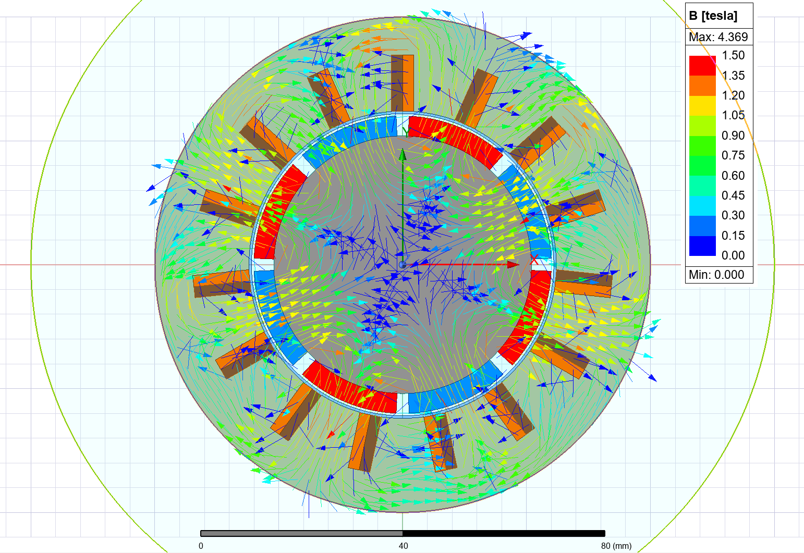
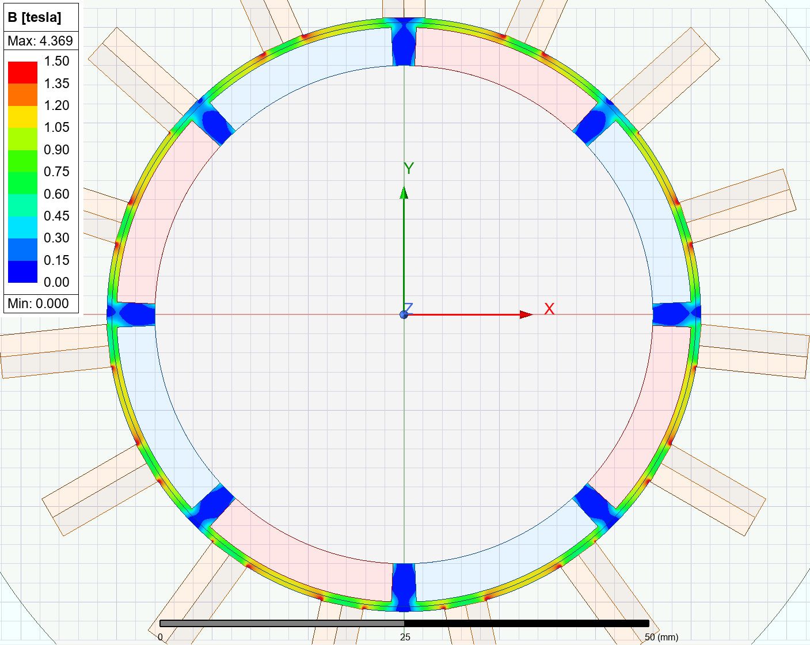
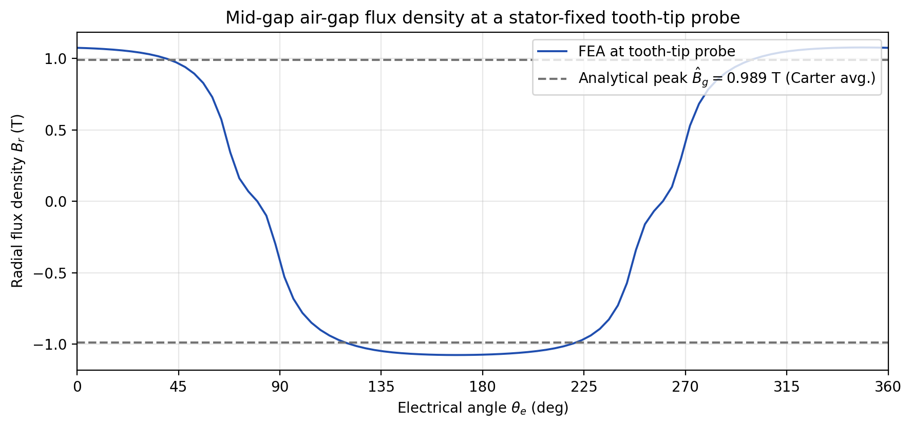
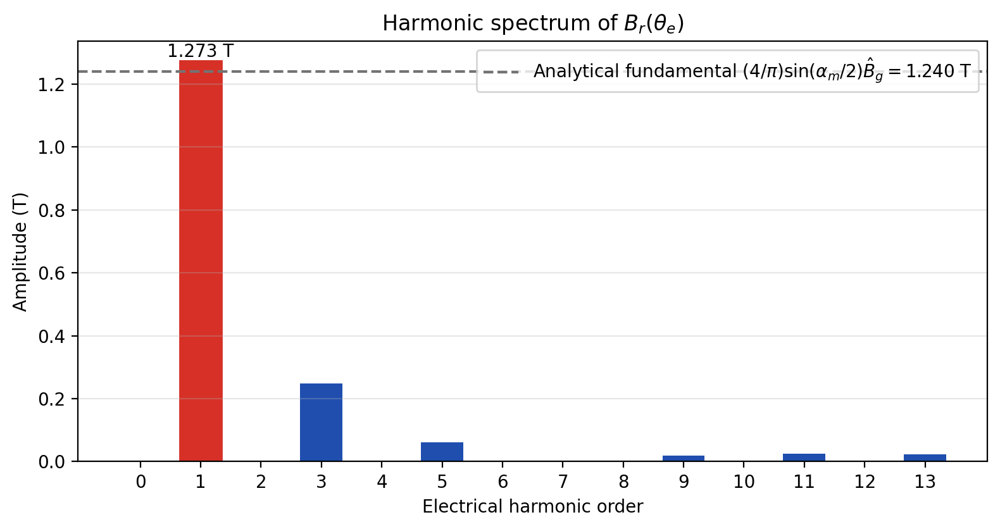
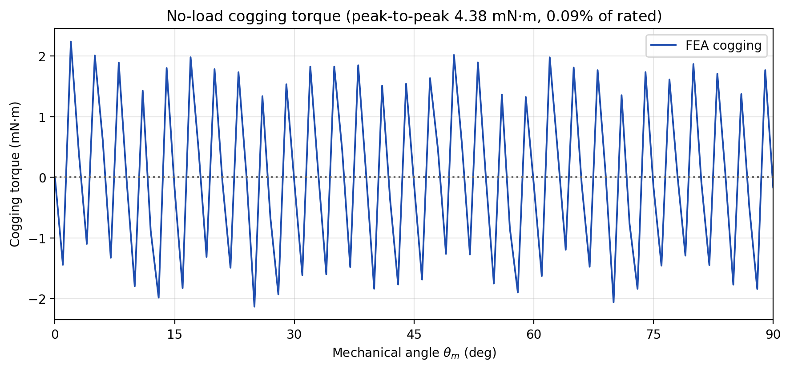
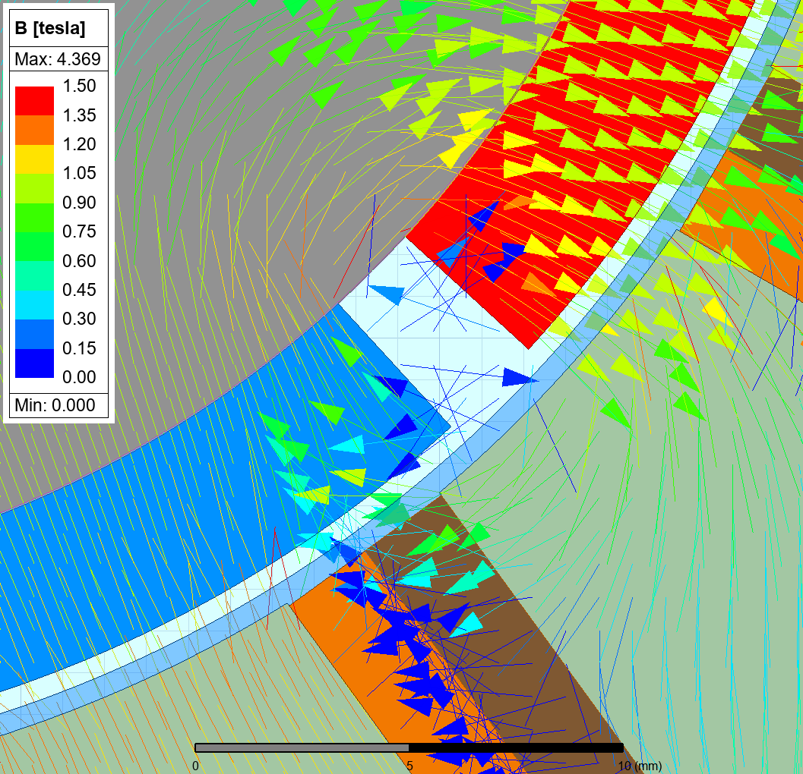
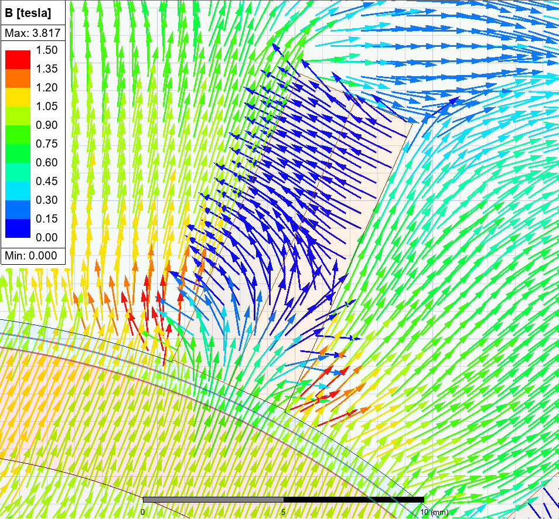
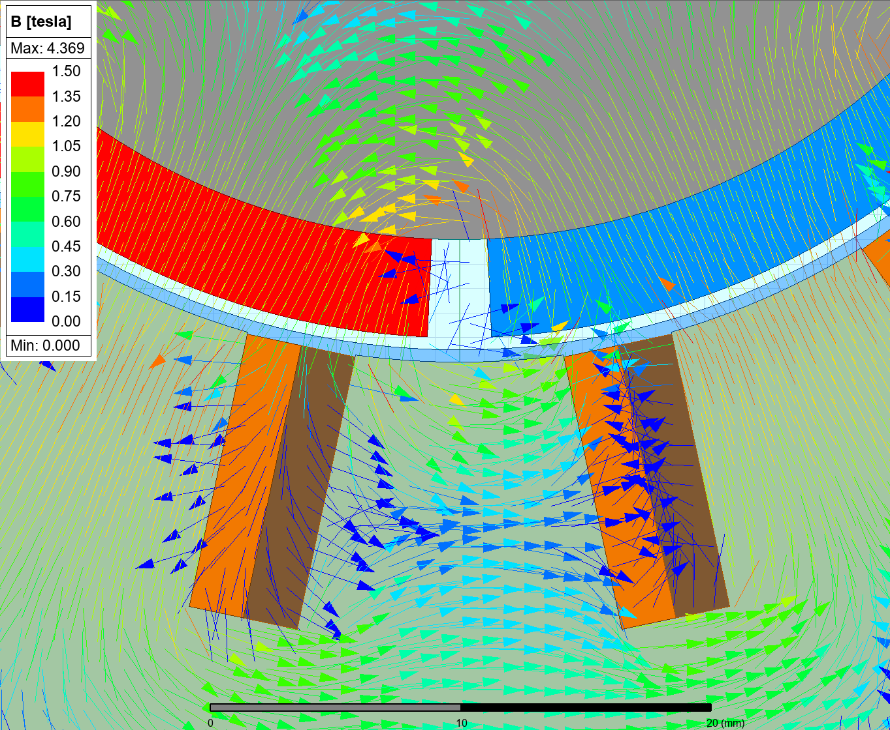

# EE568 – Design of Electrical Machines
### Project 2: Motor Winding Design & Analysis
**Sefer İDACİ — 2575421**

Design 1 (ID mod 5 = 1): **Ns = 15 slots, Nm = 8 poles**, 3-phase, fractional-slot concentrated winding (FSCW).

Full write-up: [report/EE568_HW2_Report_Sefer_IDACI_2575421.pdf](report/EE568_HW2_Report_Sefer_IDACI_2575421.pdf)

---

## Q1 — Integral-Slot Winding (72-slot, 6-pole, 3-phase)

| Configuration | k_d,1 | k_p,1 | **k_w,1** | k_w,3 | k_w,5 |
|---|---|---|---|---|---|
| Full-pitched (y = 12) | 0.9577 | 1.0000 | **0.9577** | 0.6533 | 0.2053 |
| 11/12 Short-pitched (y = 11) | 0.9577 | 0.9914 | **0.9495** | 0.6036 | 0.1629 |


---

## Q2 — Fractional-Slot Winding (15-slot, 8-pole)

Star-of-slots phasor method (α_s = 96° elec/slot, q = 0.625).

**Winding factors (concentrated-coil convention):**

| Harmonic | k_w |
|---|---|
| n = 1 | **0.9566** |
| n = 3 | 0.6472 |
| n = 5 | 0.2000 |

|  |  |
|:---:|:---:|
| Star of slots | Phase A phasors, n = 1, 3, 5 |


---

## Q3 — Analytical Modelling

| Parameter | Value |
|---|---|
| Carter coefficient k_c | 1.195 |
| Effective air gap g_eff | 5.01 mm |
| Air-gap peak flux density B_g | 0.989 T |
| Flux per pole Φ | 2.18 mWb |
| Electrical loading A_rms | 11.78 kA/m |
| Shear stress σ | 7.87 kPa |
| **Expected torque** | **4.85 N·m** |
| **Expected power** | **762 W** |
| Turns per phase N_ph | 20 |

---

## Q4 — 2D FEA (ANSYS Maxwell)

Magnetostatic parametric sweep of rotor position (0–90° mech in 1° steps) at zero phase current, with a stator-fixed probe at a tooth-tip centre to extract the air-gap field, plus a Virtual-Work torque parameter for the cogging-torque trace.

### Summary — analytical vs. FEA

| Quantity | Analytical | FEA | Diff. |
|---|---|---|---|
| Air-gap peak B̂_g (waveform top) | 0.989 T | 1.077 T | +8.9% |
| Air-gap fundamental of B_r | 1.240 T | 1.273 T | +2.7% |
| Flux per pole Φ_pole | 2.18 mWb | 2.11 mWb | −3.0% |
| Cogging T_p-p (no-load) | — | 4.4 mN·m (0.09% rated) | — |

|  |  |
|:---:|:---:|
| No-load B-vectors, full cross-section | \|B\| across the air-gap |

|  |  |
|:---:|:---:|
| Mid-gap B_r vs electrical angle | Harmonic spectrum |



**Leakage paths** (zoomed views, no-load except (c) which is under DC excitation):

|  |  |  |
|:---:|:---:|:---:|
| (a) Magnet-to-magnet | (b) In-slot | (c) Tooth-tip |

---

## Contents

```
HW2/
├── ee568_hw2_analytical.m              # MATLAB — Q1–Q3 analytical + figures
├── q3_diagrams.py                      # Python — Q3 conceptual diagrams
├── q4_bg_postprocess.py                # Python — Q4 FEA post-processing
├── q4_geometry.py                      # Python — Q4 geometry sketch
├── q4_bfield_sweep.csv                 # Maxwell export: B_x, B_y at probe vs rotor_angle
├── q4_cogging_sweep.csv                # Maxwell export: cogging torque vs rotor_angle
├── M19_24G_BH.tab                      # Iron B–H curve imported into Maxwell
├── hw2_definition.md                   # Assignment statement
├── ANSYS Project/EE568_HW2.aedt        # Maxwell 2D project file
├── q1_*.png, q2_*.png, q3_*.png        # Q1–Q3 figures
├── q4_*.png                            # Q4 figures (FEA exports + Python plots)
└── report/
    ├── EE568_HW2_Report_Sefer_IDACI_2575421.tex
    └── EE568_HW2_Report_Sefer_IDACI_2575421.pdf
```
