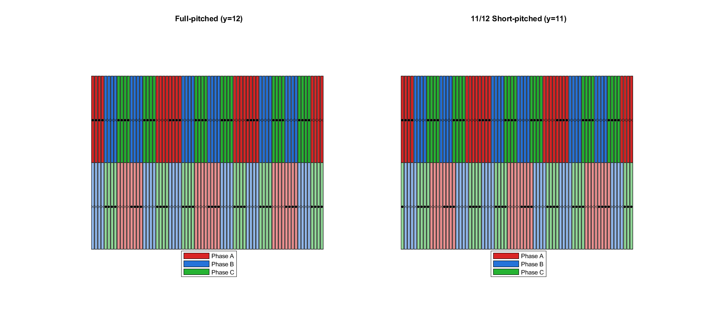
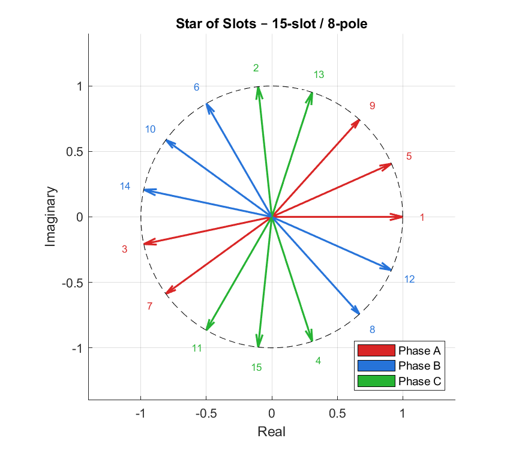
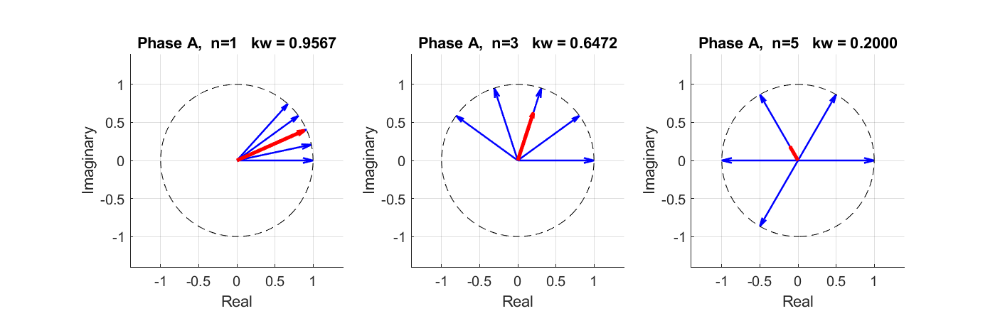
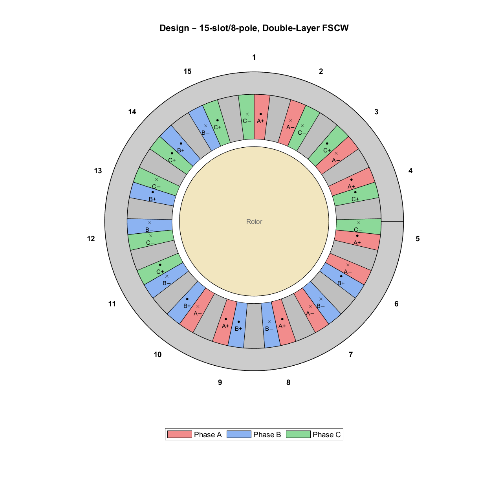

# EE568 – Design of Electrical Machines
### Project 2: Motor Winding Design & Analysis
**Sefer İDACİ — 2575421**

Design 1 (ID mod 5 = 1): **Ns = 15 slots, Nm = 8 poles**, 3-phase, fractional-slot concentrated winding (FSCW).

---

## Q1 — Integral-Slot Winding (72-slot, 6-pole, 3-phase)

| Configuration | k_d,1 | k_p,1 | **k_w,1** | k_w,3 | k_w,5 |
|---|---|---|---|---|---|
| Full-pitched (y = 12) | 0.9577 | 1.0000 | **0.9577** | 0.6533 | 0.2053 |
| 11/12 Short-pitched (y = 11) | 0.9577 | 0.9914 | **0.9495** | 0.6036 | 0.1629 |



---

## Q2 — Fractional-Slot Winding (15-slot, 8-pole)

Star-of-slots phasor method (α_s = 96° elec/slot, q = 0.625).

| Phase A slots | Layer 1 (+) | Layer 1 (−) | Layer 2 (+) | Layer 2 (−) |
|---|---|---|---|---|
| | 1, 5, 9 | 3, 7 | 4, 8 | 2, 6, 10 |

**Winding factors (concentrated-coil convention):**

| Harmonic | k_w |
|---|---|
| n = 1 | **0.9566** |
| n = 3 | 0.6472 |
| n = 5 | 0.2000 |

### Star of Slots


### Phase A Phasors (n = 1, 3, 5)


### Stator Cross-Section — Double-Layer FSCW


---

## Q3 — Analytical Modelling

| Parameter | Value |
|---|---|
| Stator inner radius R_si | 31.0 mm |
| Air-gap g | 1.0 mm |
| Magnet thickness l_m | 4.0 mm |
| Carter coefficient k_c | 1.199 |
| Effective air gap g_eff | 5.01 mm |
| Air-gap peak flux density B_g | 0.989 T |
| Flux per pole Φ | 2.18 mWb |
| Electrical loading A_rms | 11.80 kA/m |
| Shear stress σ | 7.89 kPa |
| **Expected torque** | **4.86 N·m** |
| **Expected power** | **763 W** |
| Turns per phase N_ph | 20 (8 cond/slot, V_dc = 48 V, n = 1500 rpm) |

---

## Q4 — 2D FEA (ANSYS Maxwell)

*Pending.*

---

## Contents

```
HW2/
├── ee568_hw2_analytical.m                          # MATLAB script (Q1–Q3 + figures)
├── hw2_definition.md                               # Assignment statement
├── q1_winding_layout.png                           # Q1 figure
├── q2_star_of_slots.png                            # Q2 figure
├── q2_phase_A_phasors.png                          # Q2 figure
├── q2_winding_layout.png                           # Q2 stator cross-section
├── report/EE568_HW2_Report_Sefer_IDACI_2575421.tex # LaTeX source
└── report/EE568_HW2_Report_Sefer_IDACI_2575421.pdf # Compiled report
```
