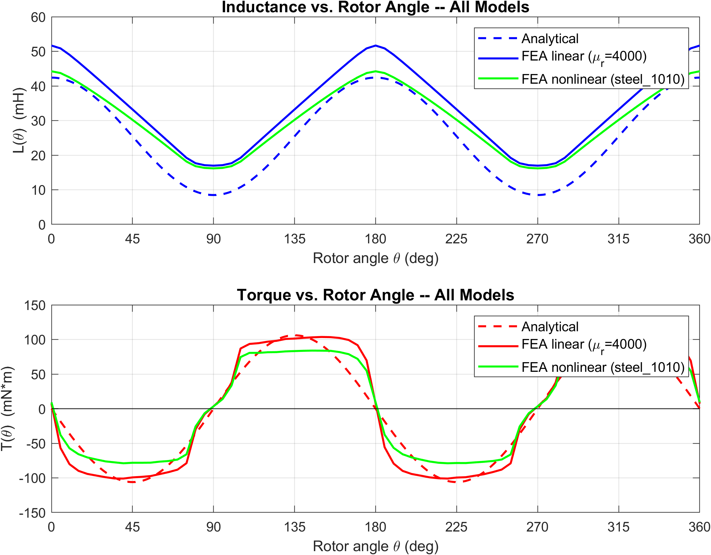
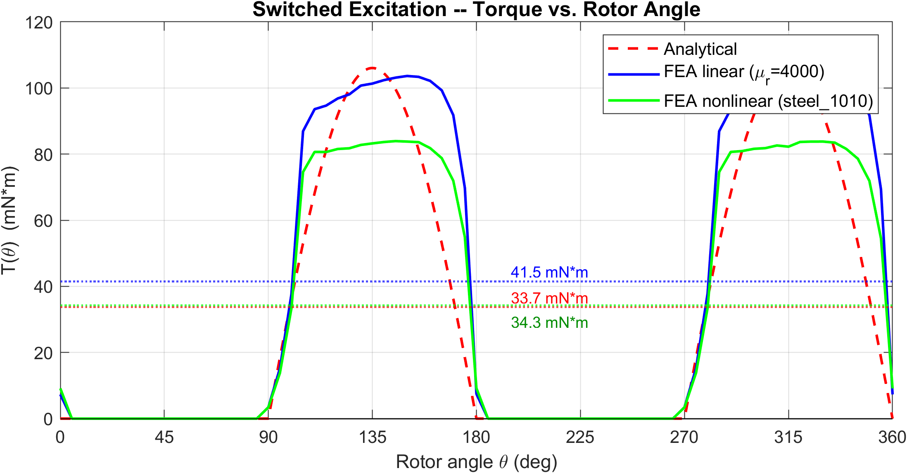
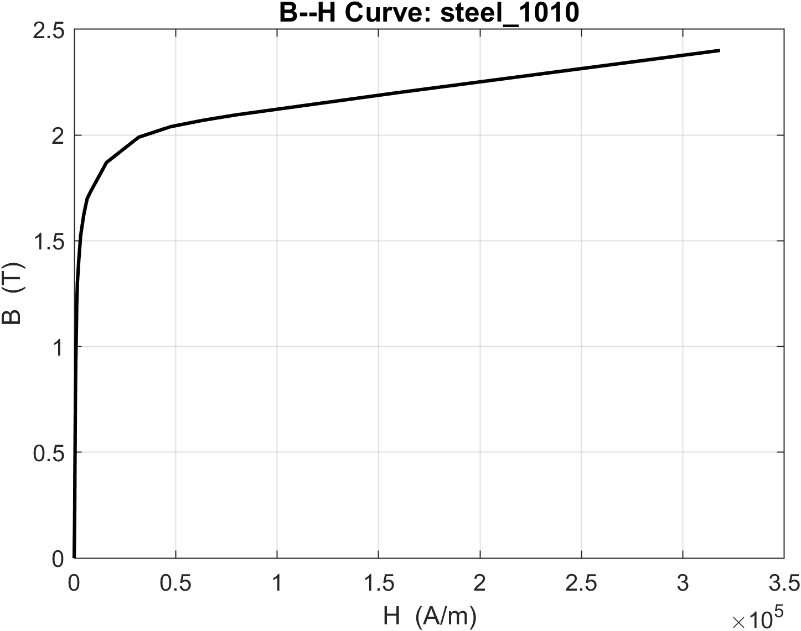

# EE568 – Design of Electrical Machines
### Project 1: Torque in a Variable Reluctance Machine
**Sefer İDACİ — 2575421**

---

## B-Field Animations

**Linear material (μr = 4000)**


**Nonlinear material (steel_1010)**


---

## Key Results

| Model | L_max (mH) | L_min (mH) | T_peak (mN·m) | T_avg switched (mN·m) |
|---|---|---|---|---|
| Analytical | 42.41 | 8.48 | 106.0 | 33.8 |
| FEA linear (μr = 4000) | 53.14 | 17.07 | 104.9 | 31.6 |
| FEA nonlinear (steel_1010) | 44.24 | 16.19 | 78.1 | 24.9 |

### Inductance & Torque — All Models


### Switched Excitation (Q4)


### B–H Curve (steel_1010)


---

## Contents

```
HW1/
├── ee568_hw1.m                               # All MATLAB figures (one script)
├── ParametricSetup1_Result.csv               # Linear FEA parametric sweep
├── ParametricSetup1_Result_nonlinear.csv     # Nonlinear FEA parametric sweep
├── steel1010_bh_curve.tab                    # B-H data exported from Maxwell
├── report/main.tex                           # LaTeX report source
└── report/main.pdf                           # Compiled report
```
